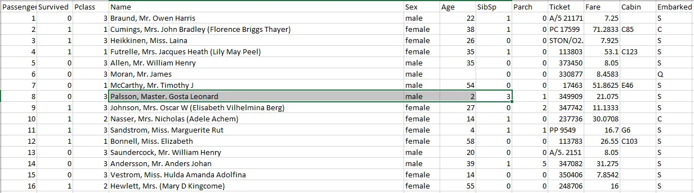

**Đề tài số 3.**
Thực hiện các nội dung yêu cầu sau

**Câu 1.**
Trình bày về khái niệm RDD và các cách thức tạo ra RDD?

**Câu 2.** Trình
bày về khái niệm và đặc điểm của Apache Spark?

**Câu 3.** Cho
tập dữ liệu về danh sách hành khách trên chuyến tàu có
nội dung như bên dưới (File đính kèm), sử dụng Spark
RDD hoặc Spark SQL để trả lời một số câu hỏi sau:

3.1.Tổng
cộng có bao nhiêu hành khách trên chuyến tàu?

3.2.
Trong số các hành khách bao nhiêu người là Nam, bao nhiêu
người là Nữ?

3.3.
Số lượng hành khách là trẻ em (Tuổi < 13) ?

3.4.
Tính số lượng hành khách là trẻ em nam và trẻ em nữ?

3.5.
Tuổi lớn nhất và nhỏ nhất của tất cả hành khách
trên chuyến tàu là bao nhiêu?

3.6.
Có bao nhiêu hành khách có cùng tuổi lớn nhất, có cùng
tuổi nhỏ nhất?

3.7.
Tính tổng số tiền vé thu được? Giá vé trung bình ?

3.8.
Liệt kê danh sách hành khách theo điều kiện giới tính
là nam, mua vé có giá lớn hơn hoặc bằng mức giá trung
bình, có tuổi lớn hơn hoặc bằng độ tuổi trung bình

3.9.
Tạo một cột mới nếu: Pclass = 1 điền là “VIP”,
Pclass = 2 điền là “Luxury”, còn lại điền là “Normal”

3.10.
Tạo một cột mới nếu thông tin cột Sex là female và
Sibsp là 1 điền là “wife”, nếu Sex là male điền là
“husband”, còn lại điền là “Other”

**Trong đó:**

Sibsp:
Số anh / chị / em / vợ / chồng trên tàu)

Parch:
Số cha mẹ / con cái trên tàu

Fare:
Giá vé hành khách

--- 
Câu 4. Sử dụng dữ liệu giải đấu Championship từ năm 2015 đến 2020 (file đính kèm) để thực hành 
streaming kết quả tổng số bàn thắng và hiệu suất ghi bàn của đội Bolton theo năm.